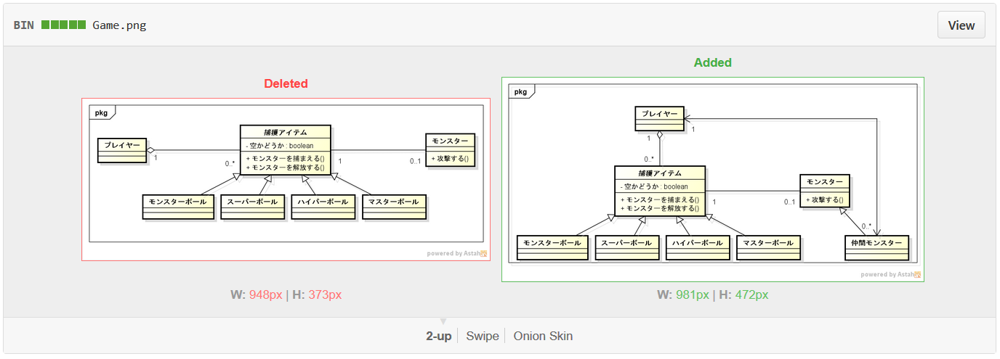
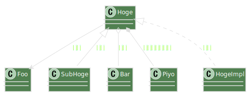

# PlantUML

----

## UML図を描こう！

何のツールを使いますか？

<ul>
<li>astah*</li>
<li>Office Visio</li>
<li>...</li>
<div class="fragment fade-up" data-fragment-index="1"><li><font size="7"><u>PlantUML</u></font></li></div>
</ul>

<p class="fragment fade-up" data-fragment-index="1">新たな選択肢を!</p>

----

# Outline

1. PlantUMLのいいこと
2. PlantUMLでの記法

----

# PlantUMLとは

テキストベースでUMLを描けるツール

http://ja.plantuml.com/

----

# example

```plantuml
title 『サラダ記念日(俵万智)』 より

私 -> あなた : 寒いね
あなた -> 私 : 寒いね
note left
温かい!
end note
```

↓


----

## PlantUMLのいいこと

## 差分が見やすい

----

バイナリファイルの場合

(GitHubの場合)


--

さすがGitHub

画像なら比較することもできるが...



どこが変わっているか分からない

... というか, なんか全体的に変わってる気がする

----

テキストファイルの場合


----

### 変わっている所が分かること、大事！

そして

### <u>変わっていない所</u>が分かること、大事！

----

## その他のいいこと

----

ファイルの競合を恐れなくてよい


----

"きれいに見せる"ことに気を使わなくてよい


----

行に対してコメントできたり...


----

コード中にも記述できたりする

```cs
/// @brief 捕獲アイテムを使う
/// @startuml{UseCaptureItem.png}
///   私 --> 捕獲アイテム : アイテムを手に持つ
///   私 --> モンスター : アイテムをぶつける
/// @enduml
public void UseCaptureItem()
{
  ...
```

Doxygen連携で, UML図付きのAPIリファレンスも

----

# Outline

1. PlantUMLのいいこと
2. PlantUMLでの記法

----

## PlantUMLでの記法

* シーケンス図・クラス図・ユースケース図...etc
* なんの図かは自動判定

----

## シーケンス図1

### メッセージ

```plantuml
送り手 -> 受け手 : 同期メッセージ
受け手 --> 送り手 : 戻りメッセージ
送り手 ->> 受け手 : 非同期メッセージ
```


--

## シーケンス図2

### 作成と破棄

```plantuml
participant main

create sub
main -> sub : 生成
sub --> main : 破棄
destroy sub
```


--

## シーケンス図3

### 実行状態

```plantuml
main -> sub : メッセージ
activate sub

  sub -> sub : 内部処理
  activate sub
  deactivate sub

sub --> main : 結果
deactivate sub
```


--

## シーケンス図4

### 複合フラグメント

```plantuml
alt ファイルがある
  loop 1, 行数
    sub -> sub : 一行読み込み
  end
else ファイルがない
  sub -> sub : エラー表示
end
```


----

## クラス図1

### クラスの関係

```plantuml
Hoge --> Foo : 関連
Hoge <|-- SubHoge : 汎化
Hoge o-- Bar : 集約
Hoge *-- Piyo : コンポジション
Hoge <|.. HogeImpl : 実現
```



--

## クラス図2

### クラスの定義

```plantuml
class Hoge {
  - int Field
  + bool Method(string arg)
}

Hoge -> Foo
```


--

## クラス図3

### クラスの種類

```plantuml
abstract 抽象クラス
interface インタフェース
enum 列挙型
class クラス <<ステレオタイプ>>
class なんでもOK << (☠, yellow) >>
```


--

## クラス図4

### パッケージ

```plantuml
クラスA -> モジュールX.クラスB
namespace モジュールX {
  クラスB -> クラスC
  クラスC -> モジュールY.クラスC
}
```


----

## ユースケース図

### アクターとユースケース

```plantuml
:アクター:

package "システム" {
  アクター -- (ユースケース)
}
```


--

## ユースケース図

### 汎化、包含、拡張

```plantuml
:アクターA: <|-- :アクターB:
(ユースケースA) <|-- (ユースケースB)
(ユースケースC) <.. (ユースケースD) : <<include>>
(ユースケースE) <.. (ユースケースF) : <<extend>>
```


----

## アクティビティ図

### アクション、開始、終了

```plantuml
(*) --> アクション
 --> (*)
```


--

## アクティビティ図

### 分岐

```plantuml
(*) --> アクションA

if "条件" then
  -> [Yes] アクションB
  --> (*)
else
  --> [No] (*)
endif
```


--

## アクティビティ図

### 並列処理

```plantuml
 (*) -> アクションA
 --> ===Fork===
 --> アクションB
 --> ===Join===
 ===Fork=== --> アクションC
 --> ===Join===
 --> (*)
```


--

## アクティビティ図

### パーティション

```plantuml
partition パーティション1 #305030 {
  (*) --> アクションA
}

partition パーティション2 #505070 {
  -up-> アクションB
  --> (*)
}
```


----

## ステートマシン図

### 遷移

```plantuml
[*] --> 状態A : 遷移A
状態A --> 状態A : 遷移B
状態A --> [*] : 遷移C
```


--

## ステートマシン図

### 状態の定義

```plantuml
state 状態A : enter / アクションA
state 状態A : do / アクションB
state 状態A : exit / アクションC

[*] -> 状態A
状態A -> [*]
```


--

## ステートマシン図

### 複合状態

```plantuml
[*] --> 状態A

state 状態A {
  [*] -> 内部状態A
  内部状態A -> 内部状態B
  内部状態B -> [*]
}

状態A --> [*]
```


--

## ステートマシン図

### 独立

```plantuml
[*] -> 状態A
state 状態A {
  [*] -> 内部状態A
  内部状態A -> 内部状態B
  内部状態B -> [*]
  --
  [*] -> 内部状態C
  内部状態C -> 内部状態C
}
状態A -> [*]
```


----


(PlantUML with Atom)
