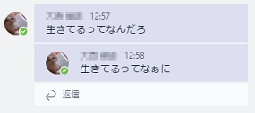
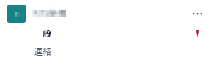

<!-- .slide: data-background="images/OC1YA30.jpg" -->

## Slack

### vs

## Teams

---

<!-- .slide: data-background="images/OC1YA30.jpg" -->

## 背景

プロジェクト内のチャットツールとして,

[Slack](https://slack.com/) を利用してきたが,

[Teams](https://products.office.com/microsoft-teams/group-chat-software) に移行することとなった.

せっかくなので, 雑感を書いてみる.

---

<!-- .slide: data-background="images/OC1YA30.jpg" -->

## Slack とは

みんなおなじみ Slack

今さら説明しなくてもいいよね☆

https://slack.com/

--

<!-- .slide: data-background="images/OC1YA30.jpg" -->

## Teams とは

Office 365 のチャットベースのワークスペース

https://products.office.com/microsoft-teams/group-chat-software

Office 365 のツールの一部として,

2017年3月15日に提供開始.

---

<!-- .slide: data-background="images/5570_1.jpg" -->

## よかったところ

---

<!-- .slide: data-background="images/5570_1.jpg" -->

### Timeline vs Thread

Slack は基本的にタイムライン

(画像載せる)

Teams は基本的にスレッド

Note:
Slack は, 2017年の初めにスレッド化機能を搭載したものの,
基本的にはタイムライン形式である.
タイムライン形式だと,
複数の会話が同時に進行したりすると,
発言が飛び交ってとても分かりにくい.
Teams はスレッドでまとめられるので,
混ざることはない.

--

<!-- .slide: data-background="images/5570_1.jpg" -->

### Timeline vs Thread

Slack は単純な時系列順

Teams は最新の投稿があったスレッドが浮上

Note:
Teams のスレッドに発言があると,
そのスレッドが一番下にくる.
2ちゃんねるの age みたい.

Slack はスレッド機能はあるものの,
スレッドに投稿しても一番下には来ない.
また, スレッドへ投稿したことは
タイムラインにも表示されないので,
タイムラインを見ている人にとっては,
スレッドの会話が進行していることに気づかない.
(※スレッドへ投稿したことをタイムラインへ表示する機能はある.)
また, 昔のスレッドは,
タイムラインの流れに埋もれてしまいやすい.

一方, Teams のスレッドは埋もれにくいという長所があるものの,
時系列がぐちゃぐちゃになるので,
嫌う人もいる.
"たしかあの会話は一週間ぐらい前にやったな..."
と思ったとき, Slack では
タイムラインを一週間遡っていけば,
投稿を見つけることができるが,
Teams では時系列順ではないので,
その会話(スレッド)はどこにあるのか見つけにくい.

---

### MS Products Collaboration

<!-- .slide: data-background="images/5570_1.jpg" -->

MS製品との連携は強い(と思う)

---

### Notification

<!-- .slide: data-background="images/5570_1.jpg" -->

Teams はスレッドに返信されると通知が飛んでくる

  
  

Note:
メンションを付けずに返信されることがあるので
個人的にはいいかんじ.

ちなみに, どういうときに通知を飛ばすかは
設定でカスタマイズ可能である.
Slack では, 全ての投稿で通知を飛ばすか,
自分宛の投稿は通知を飛ばすか,
全く通知を飛ばさないかぐらいしか選択できないが,
Teams ではもうちょっと細かく設定できる.

--

### Notification

<!-- .slide: data-background="images/5570_1.jpg" -->

ただし, 特定のキーワードが含まれるときに  
通知する機能はない

チャンネルごとの個別設定もない

---

### Important Message

<!-- .slide: data-background="images/5570_1.jpg" -->

「重要」フラグを付加することができる.

チャンネル一覧にも特別なマークが.

---

### Sticker

<!-- .slide: data-background="images/5570_1.jpg" -->

---

<!-- .slide: data-background="images/2914_1.jpg" -->

## 残念なところ

---

<!-- .slide: data-background="images/2914_1.jpg" -->

## Reminder

`/remind` コマンドで,

超お手軽にリマインドを設定できる.

---

## Message Link

<!-- .slide: data-background="images/2914_1.jpg" -->

> Everything must have a URL.

(by GitHub)

---

### Editor

<!-- .slide: data-background="images/2914_1.jpg" -->

Markdown 形式の一部をサポート (※Slack 同等)

| 種類 | サポート |
| -- | -- |
| 見出し | × |
| 箇条書き | ○ |
| 強調・斜体・打消し | ○ |
| 引用 | ○ |
| コードブロック | ○ |
| テーブル | × |

--

<!-- .slide: data-background="images/2914_1.jpg" -->

### Editor

文字を打っていると勝手に変換される

 <!-- .element: class="fragment" data-fragment-index="1" -->
 <!-- .element: class="fragment" data-fragment-index="2" -->
 <!-- .element: class="fragment" data-fragment-index="3" -->

個人的にはうっとうしい <!-- .element: class="fragment" data-fragment-index="3" -->

---

### Now Typing...

<!-- .slide: data-background="images/2914_1.jpg" -->

Teams のチャンネルには, この機能はない

(ダイレクトチャットにはある)

---

<!-- .slide: data-background="images/8499.jpg" -->

### Thank you for your attention

--

<!-- .slide: data-background="images/8499.jpg" -->

Background images of this presentation is designed by Freepik, Layerace, Harryarts, and Kjpargeter.
