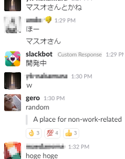

<!-- .slide: data-background="images/OC1YA30.jpg" -->

## Slack

### vs

## Teams

---

<!-- .slide: data-background="images/OC1YA30.jpg" -->

## 背景

プロジェクト内のチャットツールとして,

[Slack](https://slack.com/) を利用してきたが,

[Teams](https://products.office.com/microsoft-teams/group-chat-software) に移行することとなった.

せっかくなので, 雑感を書いてみる.

---

<!-- .slide: data-background="images/OC1YA30.jpg" -->

## Slack とは

みんなおなじみ Slack

https://slack.com/

多くの開発者が使っているチャットツール

--

<!-- .slide: data-background="images/OC1YA30.jpg" -->

## Teams とは

Office 365 のチャットベースのワークスペース

https://products.office.com/microsoft-teams/group-chat-software

Office 365 のツールの一部として,

2017年3月15日に提供開始.

---

<!-- .slide: data-background="images/OC1YA30.jpg" -->

## Teams のよかったところ

---

<!-- .slide: data-background="images/OC1YA30.jpg" -->

### Timeline vs Thread

Slack は基本的にタイムライン

Teams は基本的にスレッド

Note:
Slack は, 2017年の初めにスレッド化機能を搭載したものの,
基本的にはタイムライン形式である.
タイムライン形式だと,
複数の会話が同時に進行したりすると,
発言が飛び交ってとても分かりにくい.
Teams はスレッドでまとめられるので,
混ざることはない.

--

<!-- .slide: data-background="images/OC1YA30.jpg" -->

### Timeline vs Thread

Slack は単純な時系列順

Teams は最新の投稿があったスレッドが浮上

Note:
Teams のスレッドに発言があると,
そのスレッドが一番下にくる.
2ちゃんねるの age みたい.

Slack はスレッド機能はあるものの,
スレッドに投稿しても一番下には来ない.
また, スレッドへ投稿したことは
タイムラインにも表示されないので,
タイムラインを見ている人にとっては,
スレッドの会話が進行していることに気づかない.
(※スレッドへ投稿したことをタイムラインへ表示する機能はある.)
また, 昔のスレッドは,
タイムラインの流れに埋もれてしまいやすい.

一方, Teams のスレッドは埋もれにくいという長所があるものの,
時系列がぐちゃぐちゃになるので,
嫌う人もいる.
"たしかあの会話は一週間ぐらい前にやったな..."
と思ったとき, Slack では
タイムラインを一週間遡っていけば,
投稿を見つけることができるが,
Teams では時系列順ではないので,
その会話(スレッド)はどこにあるのか見つけにくい.

---

<!-- .slide: data-background="images/OC1YA30.jpg" -->

### Sticker

---

<!-- .slide: data-background="images/OC1YA30.jpg" -->

## Teams の残念なところ

---

<!-- .slide: data-background="images/OC1YA30.jpg" -->

## Message Link

Slack では投稿に URL が付く.

Teams では付かない.

> Everything must have a URL.

(by GitHub)

Note:
Slack ではすべての投稿に URL が付与される.
これにより, 発言を特定することができ,
後から議論に加わった人でも, リンクをたどることで,
今までの議論の内容を把握することができる.
なお GitHub 社には, "すべてのものに URL を" という言葉があるらしく,
この, "投稿に URL が付与される" という Slack の性質は,
とても重要な要素であるらしい.

一方, Teams では, 投稿に URL が付かない.
そのため, 特定の発言を指し示すことができない.
さらに不幸なことに, Teams ではスレッドが時系列順に並んでいるわけではない.
なので, 以前の発言を指し示したいときに,
"何日の何時何分の私の発言を見てください" といっても,
容易にはその発言を見つけられないのである.

---

<!-- .slide: data-background="images/OC1YA30.jpg" -->

## Reminder

Slack の `/remind` コマンド

  
  

Teams ではこれが無い.

Note:
Slack では, /remind コマンドで,
超お手軽にリマインドを設定できた.
/remind コマンドのいいところは,
自然言語っぽい書き方でリマインドが設定できるところ.
テキストだけで書けるので,
何か用事が生まれたときにサッと設定できて,
個人的にはとても重宝していた.

---

<!-- .slide: data-background="images/8499.jpg" -->

### まとめ

* Slack の方が気軽にチャットしやすい.

  * エディターが使いやすい (私好み)
  * URL が付く
  * 絵文字によるリアクション

---

<!-- .slide: data-background="images/8499.jpg" -->

### まとめ

* Teams の方が投稿に凝れる.

  * 画像の挿入や, 対応している Markdown 記法が Slack より多い
  * Sticker が楽しい

* じっくり議論に向いていそう.

  * スレッド形式のため, 1つの話題についての議論が見やすい

---

<!-- .slide: data-background="images/8499.jpg" -->

### Thank you for your attention

完全版は[こちら](./index.html)

--

<!-- .slide: data-background="images/8499.jpg" -->

Background images of this presentation is designed by Freepik, Layerace, Harryarts, and Kjpargeter.
